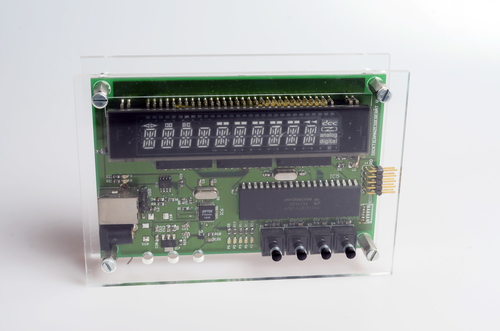
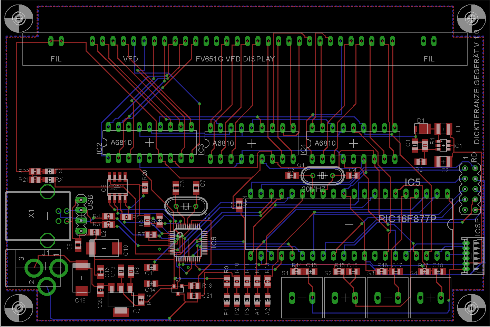

###DTAG

Device using a recycled 14-segment VFD-Display to show messages received via USB.

The name is an acronym of DickTierAnzeigeGerät, a german non-word describing the fact that the name of our overweight cat was the first thing successfully displayed. No, you do not need to remind that.

[Schematic](Images/DTAG01.sch.png)

###Tools

PIC16F877 MCU

Microchip MPLAB 7

CCS-PICC C-Compiler

PCB made with CadSoft Eagle

###License

[BSD](LICENSE-BSD.txt) for software

[Creative Commons 4.0](LICENSE-CC.txt) for pcb and other artwork

###Copyright

Copyright (c) 2016 Bjoern Seip

